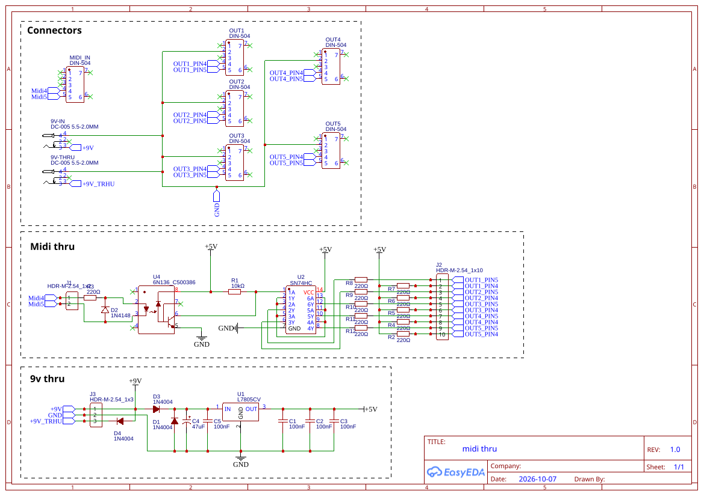
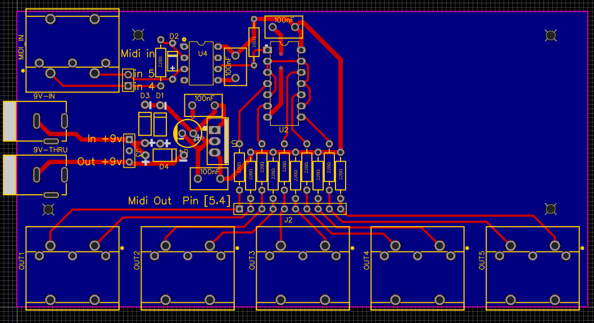

<div align="center">

# 🎹 MIDI Thru — 1 In / 5 Out

**A compact, opto-isolated MIDI splitter on a single PCB, with daisy-chainable 9 V power.**

*PCB layout by me — circuit by [Morocco Dave](https://moroccodave.com/).*



</div>

---

## About

One MIDI output, five instruments to feed. Daisy-chaining `THRU` ports adds latency and forces every box in the chain to stay powered on. A dedicated thru box fixes both.

This repository contains a **PCB design** for the classic opto-isolator + hex Schmitt trigger MIDI thru circuit. It runs from any standard **9 V centre-negative pedal supply** and passes that 9 V on through a second jack, so it slots neatly into a pedalboard or synth rack power chain.

> **Credit where it is due.**
> The circuit is Morocco Dave's MIDI Thru design, published on
> [moroccodave.com](https://moroccodave.com/) and sold as a kit through his
> [Make Synths Not War](https://makesynthsnotwar.wordpress.com/about/) project.
> He started that whole venture in 2016 by building himself a MIDI thru box.
> I did not design the circuit. **I only drew a PCB for it.** Go check out his
> music and his other DIY synth work.

---

## Features

| | |
|---|---|
| 🔌 **1 × MIDI IN** | 5-pin DIN, opto-isolated with a 6N136 |
| 🔀 **5 × MIDI OUT** | 5-pin DIN, each driven by its own 74HC14 Schmitt-trigger inverter |
| ⚡ **9 V IN + 9 V THRU** | Two 5.5 × 2.1 mm DC jacks. Power one box, chain the next |
| 🛡️ **Reverse-polarity protection** | 1N4004 diodes on the supply input |
| 🔧 **On-board 5 V regulation** | L7805 linear regulator with bulk and decoupling caps |
| 🧩 **Through-hole only** | Easy to hand-solder, beginner-friendly |
| 🖥️ **Designed in EasyEDA** | Schematic and layout, rev 1.0 |

---

## How it works

```
MIDI IN ──► 220Ω ──► 6N136 opto ──► 74HC14 (1 inverter) ──► 74HC14 (5 inverters) ──► 5 × MIDI OUT
                      ▲                                             each via 2 × 220Ω
                 1N4148 clamp
```

1. **Isolation.** The incoming current loop drives the LED inside the 6N136 optocoupler. A 1N4148 across the LED clamps reverse voltage. Nothing from the sender's ground ever touches this board, which is exactly what the MIDI spec asks for.
2. **Reshaping.** The opto's open-collector output is pulled up by a 10 kΩ resistor and fed into one gate of an SN74HC14 hex Schmitt-trigger inverter. The Schmitt hysteresis squares up the slightly rounded edges the opto produces.
3. **Fan-out.** That cleaned, inverted signal feeds the five remaining inverters in parallel. Each one inverts it back to the correct polarity and drives a MIDI OUT through the standard pair of 220 Ω resistors on pins 4 and 5.
4. **Power.** 9 V enters through a 1N4004 (reverse protection), is smoothed by 47 µF, regulated down to 5 V by the L7805, and decoupled with 100 nF ceramics at the regulator and each IC. The raw 9 V is also passed straight to the `9V-THRU` jack via a second 1N4004.

---

## PCB



Single-sided-friendly layout. All five DIN outputs line the bottom edge, MIDI IN and both power jacks sit on the left, and the two ICs plus the resistor bank live in the middle. Four mounting holes in the corners.

Two pin headers (`J1`, `J2`) break out the MIDI IN and all five MIDI OUT pin pairs. If you would rather use panel-mounted DIN sockets, or 3.5 mm TRS "MIDI mini" jacks, wire them to those headers and leave the on-board DINs unpopulated.

---

## Bill of materials

| Ref | Qty | Part | Notes |
|---|---|---|---|
| U1 | 1 | L7805CV | 5 V regulator, TO-220 |
| U2 | 1 | SN74HC14N | Hex Schmitt-trigger inverter, DIP-14 |
| U4 | 1 | 6N136 | Optocoupler, DIP-8 |
| D1, D3, D4 | 3 | 1N4004 | Supply / thru protection |
| D2 | 1 | 1N4148 | Opto LED reverse clamp |
| R1 | 1 | 10 kΩ | Opto output pull-up |
| R2–R13 | 12 | 220 Ω | MIDI IN series + 5 × (OUT pin 4 / pin 5) |
| C4 | 1 | 47 µF electrolytic | Bulk cap, 16 V or higher |
| C1, C2, C3, C5 | 4 | 100 nF ceramic | Decoupling |
| MIDI_IN, OUT1–OUT5 | 6 | 5-pin DIN socket, PCB mount | DIN-504 footprint |
| 9V-IN, 9V-THRU | 2 | DC jack 5.5 × 2.1 mm | DC-005 footprint |
| J1 | 1 | 1 × 3 pin header 2.54 mm | MIDI IN breakout (optional) |
| J2 | 1 | 1 × 10 pin header 2.54 mm | MIDI OUT breakout (optional) |
| J3 | 1 | 1 × 3 pin header 2.54 mm | Power breakout (optional) |

Use DIP sockets for U2 and U4. It costs almost nothing and saves the chips if you ever need to rework.

---

## Building it

1. Resistors and diodes first (mind the diode stripes).
2. IC sockets, then ceramic caps.
3. Electrolytic cap and voltage regulator (watch polarity and tab orientation).
4. DC jacks, then the six DIN sockets. Tack one pin, check alignment, then solder the rest.
5. **Before inserting the ICs**, plug in 9 V and confirm 5 V between `+5V` and `GND`.
6. Insert the ICs, connect a MIDI source and a synth, play a note.

Power supply: 9 V DC, centre-negative, any pedal-style supply. The whole board draws well under 50 mA.

---

## Repository layout

```
.
├── README.md
├── easyEDA/
│   ├── SCH_midi-thru.json   # EasyEDA schematic source
│   └── PCB_midi-thru.json   # EasyEDA PCB source
├── gerber/
│   └── Midi_thru.zip        # Ready-to-order Gerber package
└── references/
    ├── schematic.svg        # Schematic export, rev 1.0
    ├── PCB.png              # Board layout preview
    ├── qr-github.svg        # QR code to this repo (used on the PCB silkscreen)
    └── qr-github.png
```

### Order boards

Upload `gerber/Midi_thru.zip` to any PCB fab (JLCPCB, PCBWay, Aisler, OSH Park). Default 1.6 mm FR4, 2 layers, HASL is fine.

### Edit the design

Import `easyEDA/SCH_midi-thru.json` and `easyEDA/PCB_midi-thru.json` into [EasyEDA](https://easyeda.com/) via `File → Open → EasyEDA Source`.

---

## Credits

- **Circuit design:** [Morocco Dave](https://moroccodave.com/) — [Make Synths Not War](https://makesynthsnotwar.wordpress.com/about/). All credit for the electronics goes to him.
- **PCB layout:** this repository.
- The 6N13x + 74HC14 topology itself is a long-standing MIDI community standard. See also the [E&MM MIDIThru (1986)](https://www.muzines.co.uk/articles/eandmm-midithru/1909) for its ancestry.

## License

[](https://creativecommons.org/licenses/by-sa/4.0/)

The PCB layout and files in this repository are released under
[Creative Commons Attribution-ShareAlike 4.0 International](LICENSE) (CC BY-SA 4.0).

You may copy, modify, build and sell boards from these files, as long as you
**credit Morocco Dave for the circuit and this repository for the layout**, and
share any derivative under the same license.

The underlying circuit is Morocco Dave's work. If you reuse it elsewhere, credit him.
